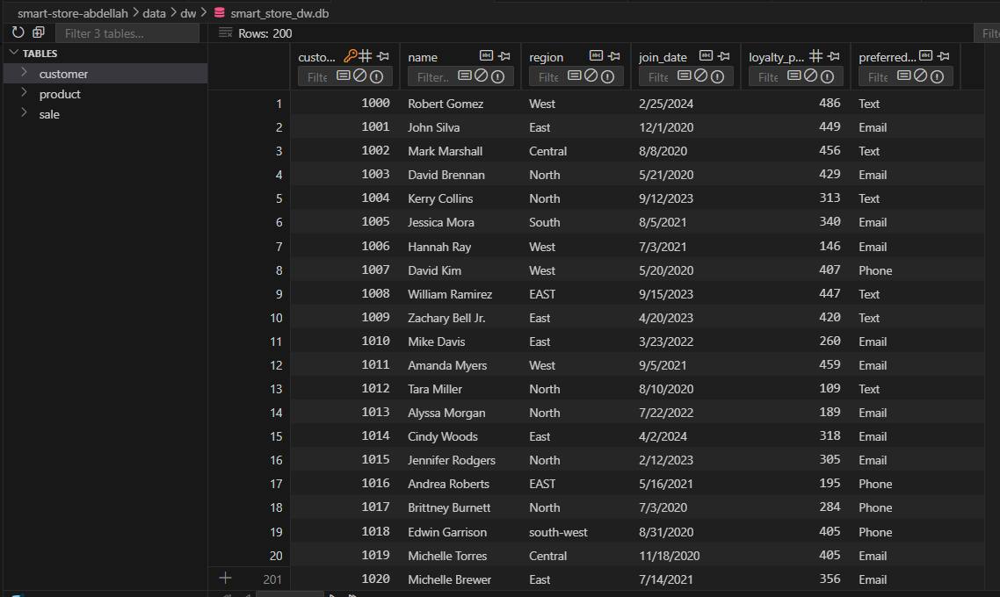
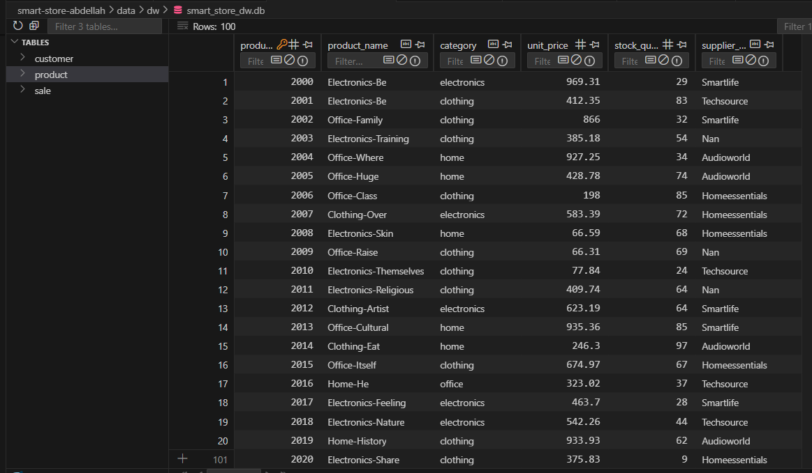
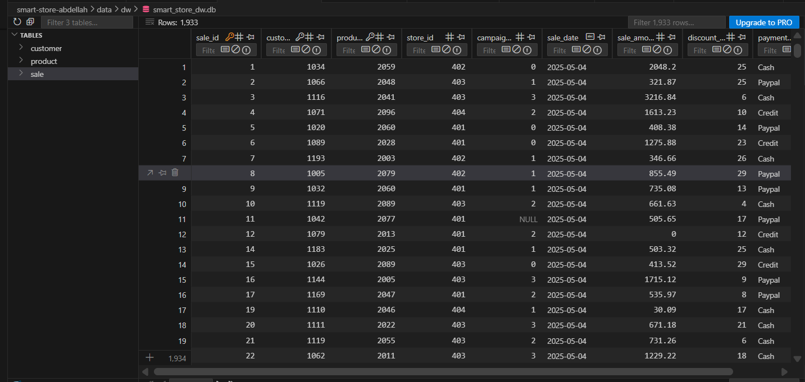
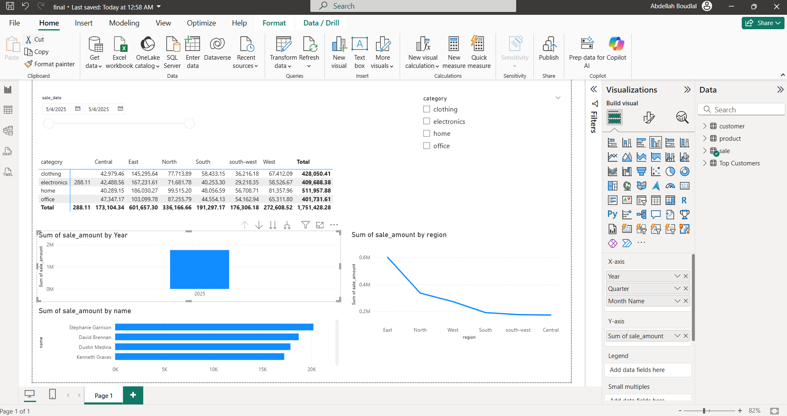
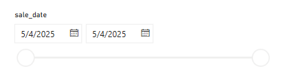
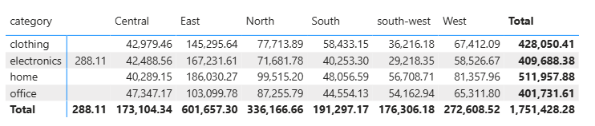
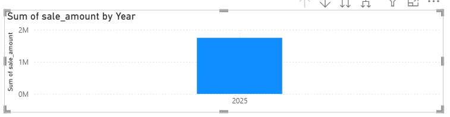
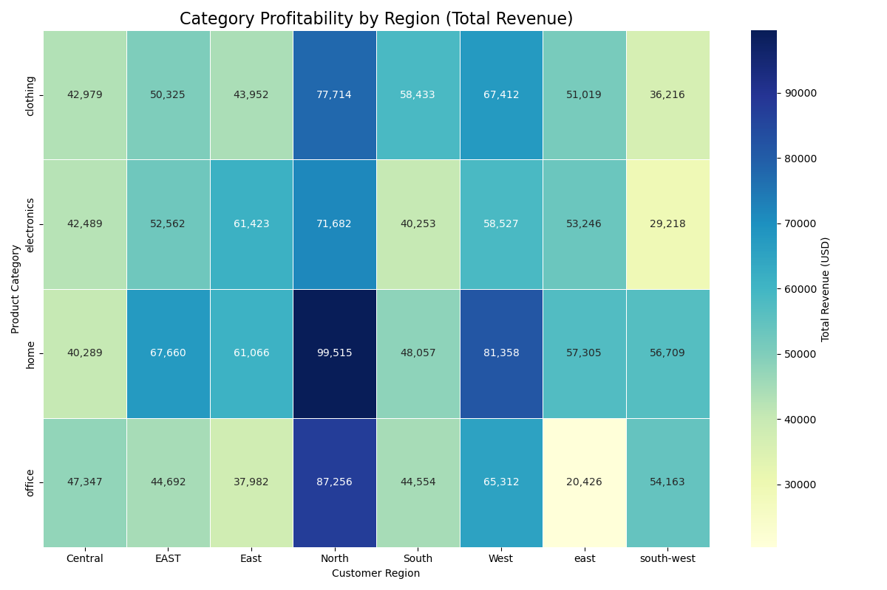

# 📊 Pro Analytics 02 -- Python Starter Repository

**Professional Python project setup and Business Intelligence
workflow.**

------------------------------------------------------------------------

## 🔗 Resources

-   **Starter Repo**
-   **Project Structure**

### 🧠 Skills we practice:

Environment Management · Code Quality · Documentation · Testing ·
Version Control

------------------------------------------------------------------------

## ⚙️ Workflow 1 -- Set Up Your Machine

Follow the setup guide to prepare your tools:

👉 **SET UP MACHINE**

------------------------------------------------------------------------

## 📂 Workflow 2 -- Set Up Your Project

Initialize your project and environment:

``` bash
uv venv
uv python pin 3.12
uv sync --extra dev --extra docs --upgrade
uv run pre-commit install
uv run python --version
```

**Activate environment:** - Windows: `.\.venv\Scripts\activate` -
macOS/Linux: `source .venv/bin/activate`

------------------------------------------------------------------------

## 🔄 Workflow 3 -- Daily Workflow

### 3.1 Sync & Pull

``` bash
git pull
uv sync --extra dev --extra docs --upgrade
```

### 3.2 Run Checks

``` bash
git add .
uvx ruff check --fix
uv run pre-commit run --all-files
uv run pytest
```

### 3.3 Documentation

``` bash
uv run mkdocs build --strict
uv run mkdocs serve
```

### 3.4 Run Demo Modules

``` bash
uv run python -m src.analytics_project.demo_module_basics
uv run python -m src.analytics_project.demo_module_stats
```

### 3.5 Run Data Preparation Modules

Execute the cleaning pipeline for each dataset individually:

``` bash
uv run python -m src.analytics_project.data_preparation.prepare_customers_data
uv run python -m src.analytics_project.data_preparation.prepare_products_data
uv run python -m src.analytics_project.data_preparation.prepare_sales_data
```

------------------------------------------------------------------------

## 🚀 Workflow 4 -- Module 3: Data Cleaning and ETL Preparation

### 🎯 Goal:

Read raw CSV files into pandas DataFrames, clean the data using reusable
logic, and save the prepared version for the next step of the ETL
process.

### ✅ Steps Completed

-   Created cleaning orchestrator: `src/analytics_project/data_prep.py`
-   Implemented customer, product, and sales cleaning
-   Configured logging (`project.log`)
-   Added unit tests in `tests/test_data_scrubber.py`
-   Ran the cleaning pipeline:

``` bash
uv run python -m src.analytics_project.data_prep
```

------------------------------------------------------------------------

## 🎯 Results

Prepared files saved in `data/prepared/`:

-   `customers_prepared.csv`
-   `products_prepared.csv`
-   `sales_prepared.csv`

------------------------------------------------------------------------

# ⭐ Workflow 5 -- Module 4: Data Warehouse (P4)

## 🎯 Objective

Design and implement a full **Data Warehouse (DW)** using a **star
schema** and load cleaned datasets into SQLite to support BI analytics.

------------------------------------------------------------------------

## 1️⃣ Design Choices

### ⭐ Star Schema

Chosen because it provides:

-   Fast analytical performance\
-   Clear relationship modeling\
-   Easy BI integration

### ⭐ Full Column Version

The DW keeps **all columns** from the cleaned CSVs to preserve business
richness.

------------------------------------------------------------------------

## 2️⃣ Schema Implementation

DW file located at:

    data/dw/smart_store_dw.db

### 📐 Final Schema (Full Version)

#### Customer Dimension

``` sql
CREATE TABLE customer (
    customer_id INTEGER PRIMARY KEY,
    name TEXT,
    region TEXT,
    join_date TEXT,
    loyalty_points INTEGER,
    preferred_contact_method TEXT
);
```

#### Product Dimension

``` sql
CREATE TABLE product (
    product_id INTEGER PRIMARY KEY,
    product_name TEXT,
    category TEXT,
    unit_price REAL,
    stock_quantity INTEGER,
    supplier_name TEXT
);
```

#### Sales Fact Table

``` sql
CREATE TABLE sale (
    sale_id INTEGER PRIMARY KEY,
    customer_id INTEGER NOT NULL,
    product_id INTEGER NOT NULL,
    store_id INTEGER,
    campaign_id INTEGER,
    sale_date TEXT,
    sale_amount REAL,
    discount_percent REAL,
    payment_type TEXT,
    FOREIGN KEY (customer_id) REFERENCES customer(customer_id),
    FOREIGN KEY (product_id) REFERENCES product(product_id)
);
```

------------------------------------------------------------------------

## 3️⃣ ETL Pipeline

ETL file:

    src/analytics_project/etl_to_dw.py

### ✔ Tasks performed:

-   Create DW folder & DB\
-   Create tables\
-   Drop duplicates using `drop_duplicates()`\
-   Load CSVs\
-   Insert into DW

### ▶️ Run ETL:

``` bash
uv run python -m src.analytics_project.etl_to_dw
```

------------------------------------------------------------------------

## 4️⃣ Validation (Task 3)

Using SQLite Viewer in VS Code, I ran:

``` sql
SELECT name FROM sqlite_master WHERE type='table';
PRAGMA table_info(customer);
PRAGMA table_info(product);
PRAGMA table_info(sale);
SELECT COUNT(*) FROM customer;
SELECT COUNT(*) FROM product;
SELECT COUNT(*) FROM sale;
SELECT * FROM sale LIMIT 10;
```

### 📸 Screenshots

Screenshots are stored in `docs/images/`:







------------------------------------------------------------------------

## ⚠️ Challenges & Solutions

### 🔴 Challenge: Duplicate Primary Keys

`UNIQUE constraint failed` appeared for customer_id, product_id, and
sale_id.

### 🟢 Solution:

Used pandas:

``` python
df.drop_duplicates(subset=["CustomerID"])
```

This ensured clean inserts.

------------------------------------------------------------------------

## 📤 Git Workflow

``` bash
git add .
git commit -m "feat: add DW design, ETL pipeline, validation screenshots"
git push
```

------------------------------------------------------------------------

# ⭐ Workflow 6 -- Module 5: Business Intelligence Reporting (P5)

## 🎯 Objective

Analyze the Data Warehouse using Power BI and demonstrate OLAP operations.

---

## 1️⃣ Operating System & Tools

- Windows 11
- Power BI Desktop
- SQLite ODBC Driver (64-bit)
- ODBC DSN: SmartSalesDSN
- Power Query (SQL transformations)

---

## 2️⃣ Power BI Model View



---

## 3️⃣ SQL Query for Top Customers

```m
let
    Source = Odbc.Query(
        "dsn=SmartSalesDSN",
        "
        SELECT c.name,
               SUM(s.sale_amount) AS total_spent
        FROM sale s
        JOIN customer c ON s.customer_id = c.customer_id
        GROUP BY c.name
        ORDER BY total_spent DESC;
        "
    )
in
    Source
```

---

## 4️⃣ OLAP Operations

### 🟦 Slicing



### 🟩 Dicing



### 🟨 Drilldown



---


# ⭐ Workflow 7 — Module 6: Advanced OLAP Cubing (P6) 🚀

## 🎯 Objective

Analyze profitability using Python and OLAP techniques on a pre-defined data cube, generating a key business visualization.

---

## 1️⃣ Data Preparation & Cubing

This phase modifies the ETL process to create the analytical cube required for the P6 goal.

| Python Files | Role |
| :--- | :--- |
| `cubing.py` | **Modified** to perform `sale`/`product`/`customer` joins to extract the `region` and `category` dimensions. |
| `goal_profitability_analysis.py` | **New script** to execute the OLAP analysis and visualization. |

### 🔑 Dimensions & Metric

- **Dimensions:** `region`, `category`
- **Aggregated Metric:** `sale_amount_sum` (Total Revenue)

### ▶️ Run Analysis

The cube must be generated before the analysis can run:

```bash
# 1. Generate the cube with the correct dimensions (using PYTHONPATH fix)
$env:PYTHONPATH="src"; python -m analytics_project.olap.cubing

# 2. Execute the OLAP analysis and generate the Heatmap
$env:PYTHONPATH="src"; python -m analytics_project.olap.goal_profitability_analysis
```

---

## 2️⃣ OLAP Analysis & Insights 💡

### 🧠 OLAP Logic Implemented

The analysis utilizes the cube to simulate core OLAP operations for business insight extraction.

| Technique | Logic Applied | Business Role |
| :--- | :--- | :--- |
| **Slicing** | Filtered for a **Single Region** (e.g., `EAST`) to identify top local performers. | Determines regional stock allocation and marketing priorities. |
| **Dicing** | Filtered for combinations of `region`/`category` below the calculated overall mean revenue. | Highlights underperforming segments requiring immediate intervention. |
| **Drilldown (Intent)** | Documented the intent to drill from the `category` level to the `product_name` level on the lowest-performing segment. | Aims to identify if poor performance is driven by one or two specific products. |

### 📊 Visualization (Heatmap)

The profitability **Heatmap** (`category_region_heatmap.png`) serves as the core deliverable, clearly illustrating performance variances across dimensions.



---
## 3️⃣ Key Results & Suggested Actions

The following analysis is derived directly from the **Category Profitability by Region** heatmap.

### ✅ Insights Discovered

- **Critical Underperformer:**  
  The **"Office"** category in the **"East"** region generates the **lowest revenue** on the entire map (**$20,426**), marking the most urgent problem area for the business.

- **Top Performance (Opportunity):**  
  The **"Home Goods"** category performs exceptionally well in both the **North** (**$99,515**) and **West** (**$81,358**) regions, identifying two strong, high-value markets with proven demand.

- **Misinterpreted Strength:**  
  The **"Clothing"** category is actually **strongest in the North region** (**$77,714**), confirming that this is a viable and profitable market—**contrary to the initial assumption** that it underperformed.

---

### ➡️ Recommended Actions

The following actions have been updated to focus on the true underperforming segment:

1. **Inventory Reduction (Targeted):**  
   Immediately **reduce stocking, purchasing, and marketing spend** for **"Office"** category products in the **"East"** region, which represents the **least profitable** segment.

2. **Budget Reallocation (Growth Strategy):**  
   **Increase investment and promotional budget** for **"Home Goods"** in the **North** and **West** regions to capitalize on the strong and consistent demand.

3. **Root Cause Analysis (Drilldown):**  
   Perform a detailed **Level 4 OLAP drilldown** on the worst-performing combination — **"Office"** in **"East"** — to determine whether the loss is caused by:
   - a specific SKU/product,  
   - supplier pricing issues,  
   - or low consumer interest.

---

## 👨‍💻 Author

Abdellah Boudlal  
GitHub: https://github.com/Aboudlal

